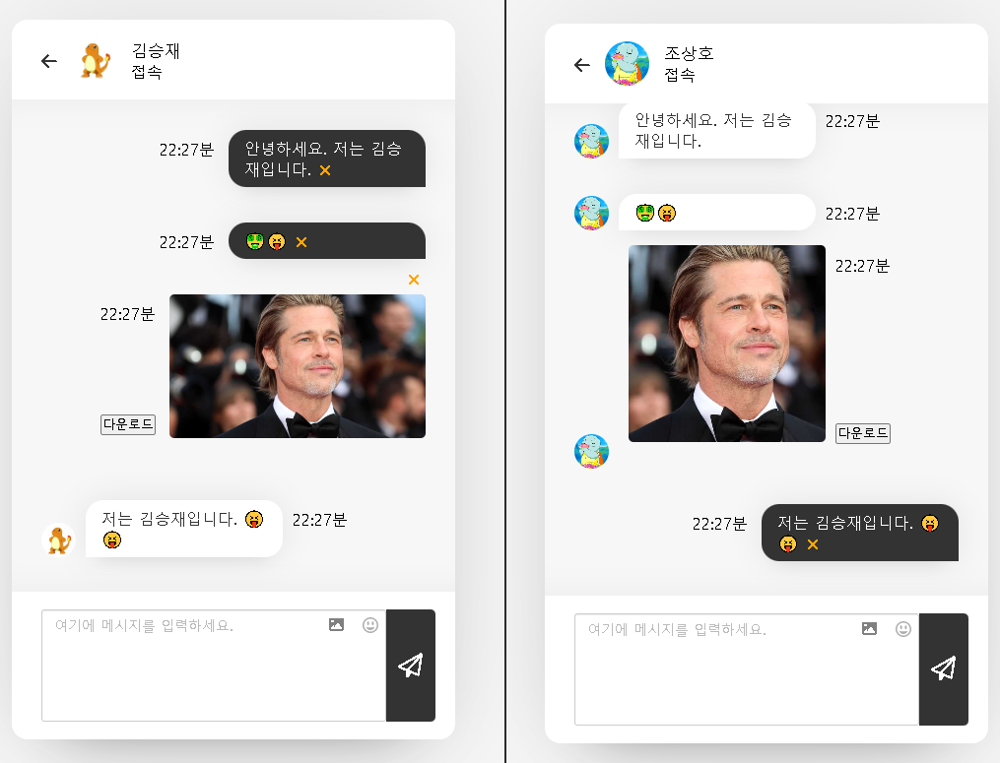
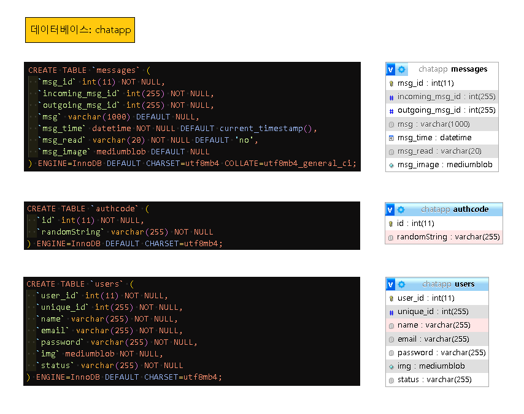
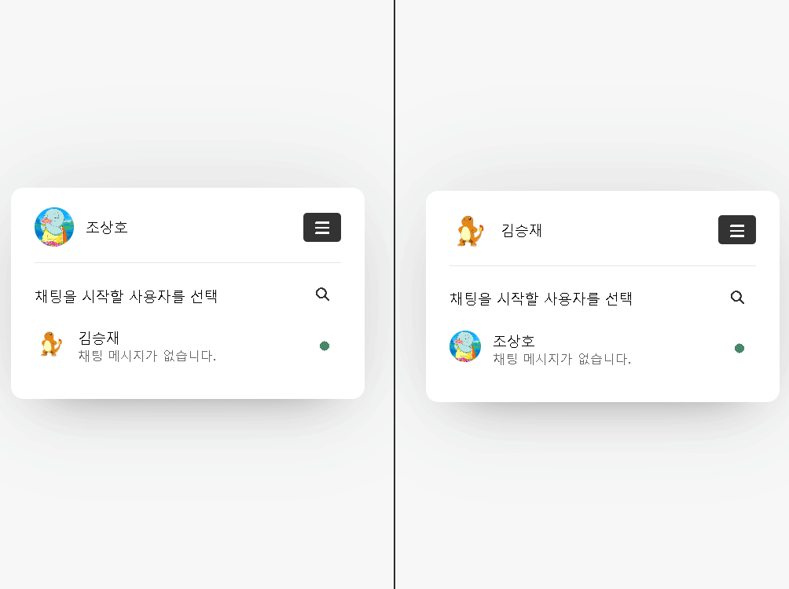

## 채팅 애플리케이션

| 목차                                |                                    |
| ----------------------------------- | ---------------------------------- |
| [1. 작성자](#작성자)                | [2. 사이트 사용법](#사이트-사용법) |
| [3. 테스트 영상](#테스트-영상)      | [4. 사이트](#사이트)               |
| [5. 프론트엔드](#프론트엔드)        | [6. 서버](#서버)                   |
| [7. 디비](#디비)                    | [8. 개발 환경](#개발-환경)         |
| [9. 도메인](#도메인)                | [10. 서버 호스팅](#서버-호스팅)    |
| [11. 데이터베이스](#데이터베이스)   | [12. 실행 장면](#실행-장면)        |
| [13. 프로젝트 구조](#프로젝트-구조) | [14. API 명세서](#API-명세서)      |
| [15. 참고 자료](#참고-자료)         | [16. 라이센스](#라이센스)          |
| [17. 만든 이유](#만든-이유)         | [18. 배운 점](#배운-점)            |
| [19. 확인 요망](#확인-요망)         | [20. 수정 요망](#수정-요망)        |
| [21. 디비 사용법](#디비-사용법)     | [22. 소스 사용법](#소스-사용법)    |

### 작성자

<pre>

- 조상호

- hyundai_sangho@naver.com

</pre>

### 사이트 사용법

<pre>
혼자서 테스트 할 때는 서로 다른 2개의 브라우저
Edge 브라우저와, Chrome 브라우저를 열고 각각 https://chosangho.site/ 사이트에 들어가서
각자 다른 이메일로 회원 가입을 하면 로그인 처리가 되고 대화 상대방을 선택해서 채팅이 가능함.
</pre>



### [테스트 영상](https://youtu.be/d1wjxqq0PQ0) 🔗

### [사이트](https://chosangho.site/) 🔗

### 프론트엔드

<pre>
HTML, CSS, JS

라이브러리: jquery, font-awesome(아이콘), emojionearea(이모티콘)
</pre>

### 서버

<pre>
PHP

라이브러리: phpdotenv(환경변수), phpmailer(이메일), monolog(로그 기록)
</pre>

### 디비

<pre>MariaDB</pre>

### 개발 환경

<pre>

Windows 10 pro

VSCode 1.78.0

Vivaldi Browser 6.0.2979.18

Chrome Browser 112.0.5615.138

Edge Browser 113.0.1774.42

XAMPP 8.1.2

- PHP 8.1.2
- MariaDB 10.4.22
- Apache/2.4.52
- phpMyAdmin 5.1.1

MobaXterm 23.0

WinScp 5.21.7

Postman 10.14.2

</pre>

### 도메인

<pre>GoDaddy (chosangho.site)</pre>

### 서버 호스팅

<pre>

aws EC2 (Ubuntu 20.04.6)

Lampp 7.4.29 설치

Route 53 - 고대디에서 구매한 도메인 연결

Certificate Manager https 인증서

로드 밸런서 사용(https 적용)

</pre>

### 데이터베이스



### 실행 장면



### 프로젝트 구조

```
chatting
├─ .gitignore                           => 깃으로 버전 관리시 필요 없는 데이터는 따로 기록 관리
├─ .htaccess                            => /login.php, /chat.php 와 같이 루트 경로 바로 뒤에 오는 페이지를
│                                          /views/login.php, /views/chat.php 와 같이 경로를 views 폴더로 보내버림
├─ assets                               => css, js, img, favicon, icon 폴더 모음
│  ├─ css
│  │  └─ style.css                      => index.php, views 폴더 내부의 php 파일들을 style.css 파일 하나로 관리(파일 분리 필요)
│  ├─ icon
│  │  ├─ android                        => pwa 안드로이드에서 사용하는 아이콘 모음
│  │  ├─ ios                            => pwa IOS에서 사용하는 아이콘 모음
│  │  └─ windows11                      => pwa windows11에서 사용하는 아이콘 모음
│  ├─ img
│  │  ├─ base
│  │  │  ├─ default.png                 => 회원 가입시에 프로필 사진을 선택하지 않는다면 이 기본 이미지가 선택됨.
│  │  │  └─ talk.png                    => 사이트 브랜드 아이콘
│  │  └─ favicon                        => 데스크탑 브라우저 화면에서 사이트를 열었을 시에 탭 화면 타이틀 왼쪽에 나오는 아이콘
│  ├─ js
│  │  ├─ auth-code.js
│  │  ├─ chat.js                        => chat.php의 채팅 화면에서 발생하는 자바스크립트 동작(비동기로 채팅 데이터 받아오기)
│  │  ├─ edit-profile.js                => edit-profile.php 프로필 수정 화면에서 발생하는 자바스크립트 동작(비동기 작업)
│  │  ├─ find-password.js               => find-password.php 비밀번호 찾기 화면에서 발생하는 자바스크립트 동작(비동기 작업)
│  │  ├─ login.js                       => login.php의 로그인 화면에서 발생하는 자바스크립트 동작(비동기 작업)
│  │  ├─ pass-show-hide.js              => index.php, login.php의 비밀번호 입력 창에서 눈알 아이콘을 눌렀을시 발생하는 동작
│  │  │                                    (비밀번호 속성을 text, password로 토글)
│  │  ├─ signup.js                      => index.php의 회원가입 버튼을 클릭시에 발생하는 동작(비동기 작업)
│  │  ├─ users.js                       => users.php에서 채팅할 상대를 검색하는 동작(비동기 작업)
│  │  └─ verify-password.js
│  └─ screen.png
├─ composer.json                        => 프로젝트에 사용한 vlucas/phpdotenv 라이브러리 정리
├─ composer.lock                        => composer install시 생기는 파일로 composer.json에 기록된
│                                          라이브러리와 연관된 항목과 버전이 기술됨
├─ db
│  ├─ .htaccess                         => db 폴더에 url로 직접 접근하지 못하도록 제한 설정한 파일
│  └─ Database.php                      => DB 연동 및 데이터 검색, 입력, 회원가입, 로그인, 로그아웃 등의 모든 디비 작업 모음
├─ index.php                            => 회원가입 화면(페이지 첫 화면)
├─ log
│  └─ error.log                         => 사이트 이용 중 발생하는 에러 정보들을 기록
├─ manifest.json                        => pwa 연관된 정보 항목이 기록된 json 파일
├─ offline.html                         => 화면이 오프라인이 될 때 실행되는 페이지
├─ pwabuilder-sw.js                     => 화면이 오프라인 상태가 될 시에 offline.html을 화면에 출력
├─ README.md                            => 프로젝트에 대한 설명 및 사용 방법 등에 대한 기록이 적혀있는 문서
├─ screenshot
│  └─ databaseTable.png                 => 데이터베이스 테이블 구조 화면
│  └─ play.gif                          => 테스트 GIF
├─ sql
│  └─ chatapp.sql                       => messages, users, authcode 테이블에 관련된 sql 파일
├─ user
│  ├─ auth-code.php                     => 이메일 인증 코드 화면에서 인증 코드가 제대로 입력이 됐는지 확인 작업을 하는 php
│  ├─ auth-email.php                    => 회원 가입 화면에서 이메일 입력 후 인증 버튼을 눌렀을 시 동작하는 php(입력하는 이메일로 인증 코드 보냄)
│  ├─ data.php                          => users.php 화면에서 대화 상대자 목록을 가져오는 php
│  ├─ delete-message.php                => chat.php 채팅 화면에서 채팅 데이터를 삭제 X 버튼을 누르면 채팅 데이터를 삭제 동작을 하는 php
│  ├─ edit-profile.php                  => 사용자 프로필 수정 화면에서 받아온 POST 데이터 값들을 디비와 연동해 프로필 수정
│  ├─ emailAuthCode-sessionDestroy.php  => 회원 가입 화면에서 이메일 인증 버튼을 눌른 후에 3분 안에 회원 가입을 안 하고 시간만 지나면 이메일 인증코드 세션 삭제
│  ├─ find-password.php                 => 비밀번호 찾기 화면에서 이름과 이메일을 입력하면 해당 이메일로 인증 코드가 발송이 되는 작업을 하는 php
│  ├─ get-chat.php                      => 채팅 데이터를 디비에서 가져오는 php
│  ├─ get-profile.php                   => 채팅 화면에서 채팅 상대방의 프로필 접속, 비접속 상태를 체크하는 작업을 하는 php
│  ├─ insert-chat.php                   => 채팅 데이터를 디비에 입력하는 php
│  ├─ login.php                         => 로그인을 처리하는 php
│  ├─ logout.php                        => 로그아웃 처리를 담당하는 php (쿠키, 세션 제거)
│  ├─ maintain-login.php                => 로그인 상태 유지를 처리하는 php (쿠키에 로그인 이메일 데이터 저장)
│  ├─ search.php                        => users.php 화면에서 검색시 사용자 데이터를 가져오는 php
│  ├─ signup.php                        => 회원가입 창에서 입력한 폼 데이터를 디비와 연동해 INSERT 처리 작업
│  ├─ users.php                         => users.php 화면에서 사용자 전체 데이터를 가져오는 php
│  └─ verify-password.php               => 비밀번호 확인 화면에서 로그인하기 버튼을 누르면 작동하는 php(이름, 이메일 쿠키 제거, 이메일 인증 코드 세션 삭제)
└─ views
   ├─ auth-code.php                     => 이메일 인증 코드 화면
   ├─ chat.php                          => 채팅 화면
   ├─ edit-profile.php                  => 사용자 프로필 수정 화면
   ├─ find-password.php                 => 비밀번호 찾기 화면
   ├─ header.php                        => views 폴더 내부에 php 및 index.php에 들어가는 헤더 부분 font-awesome, style.css, pwa, favicon
   ├─ login.php                         => 이메일 로그인 화면
   ├─ users.php                         => 대화 상대방 검색 및 선택 화면
   └─ verify-password.php               => 비밀번호 찾기 화면, 이메일 인증 코드 화면을 거쳐서 나오는 비밀번호 확인 화면

```

### API 명세서

| Index | Method | End Point        | 기능     |
| :---: | :----: | :--------------- | :------- |
|   1   |  POST  | /user/signup.php | 회원가입 |

<pre>
• Request (Body)

  {
    "compressedFile": "data:image/jpeg;base64,/9j/4AAQSkZJRgABAQAAAQABAAD/4g",
    "name": "조장혁",
    "email": "chojanghyuk@naver.com",
    "authCode": "7587843448",
    "password": "!chojanghyuk123"
  }

• Response

  [성공]
  { code : 200, message : 회원 가입 성공 }

  [실패]
  1) 세션 authCode와 회원가입 화면에서 입력한 입력 코드 값이 다를 때
  { message: 인증 코드가 다릅니다. }

  2) 이미 디비에 존재하는 이메일을 입력했을 때
  { message: 이미 존재하는 이메일입니다. }
</pre>

| Index | Method | End Point                             | 기능                       |
| :---: | :----: | :------------------------------------ | :------------------------- |
|   2   | DELETE | user/emailAuthCode-sessionDestroy.php | 이메일 인증 코드 세션 삭제 |

<pre>
• Response

  [성공]
  { code: 200, message: 이메일 인증 코드가 성공적으로 삭제되었습니다. }

  [실패]
  1) 이메일 인증 코드가 세션에 존재하지 않은 상태에서 세션 삭제를 요구할 때
  { message: 이메일 인증 코드가 존재하지 않아 삭제할 수 없습니다. }

  2) Request Method가 DELETE 요청이 아닐 때
  { message: DELETE 요청이 아닙니다. }
</pre>

### 참고 자료

- [Chat Application using PHP with MySQL & JavaScript](https://www.youtube.com/watch?v=VnvzxGWiK54) 🔗

### 라이센스

- [GPL 라이센스를 사용합니다.](https://ko.wikipedia.org/wiki/GNU_%EC%9D%BC%EB%B0%98_%EA%B3%B5%EC%A4%91_%EC%82%AC%EC%9A%A9_%ED%97%88%EA%B0%80%EC%84%9C) 🔗

### 만든 이유

<pre>
웹 개발에 대해 공부를 하다 보니 평소에 사용하는 채팅 서비스는
어떻게 비동기로 데이터를 주고 받는지 궁금함이 커져 만들게 되었습니다.</pre>

### 배운 점

<pre>
1. DB connection을 사용 후 끊어주지 않고 여러 PHP 파일에서
   DB 연결이 쌓이면 데이터를 가져오는 시간이 길어져
   DB 데이터를 받아서 화면에 뿌려주는 데이터들이
   빨리 받아오지 못해 화면에 로딩이 걸려버린다.

   DB 사용 후 작업이 끝나면 디비 커넥션을 끊어준다.
   ex) $conn = null;

2. .htaccess 파일을 사용하기 때문에 nginx 서버 대신에 아파치 사용 요망

3. AWS 프리티어 수준의 서버 컴퓨터에서 PHP에 무거운 동작을 수행하게 되면 속도 저하 발생
   가능한 범위에서 브라우저 단에서 자바스크립트로 처리할 수 있는 것들은 처리를 하고
   PHP로 값을 넘겨준 뒤 작업을 하게 되면 사이트 버벅임 예방에 도움이 됨
   예를 들어 사용자가 고용량 이미지 파일을 올리려고 한다면 자바스크립트로 애초에
   이미지 용량 제한을 둬서 막고 저용량 이미지가 업로드된다 하더라도 자바스크립트로
   압축을 해서 용량을 줄인 뒤에 서버에 올라갈 수 있도록 조치

4. 같은 작업을 자바스크립트로 할 수 있고 PHP로도 할 수 있다면 자바스크립트로 처리할 수 있는 작업은
   최대한 처리를 해서 PHP로 보내 서버에 부담을 줄이도록 한다.

5. 개인 컴퓨터에서 윈도우로 돌릴 땐 잘 돌아가더라도 AWS 서버 컴퓨터에서 우분투 리눅스로
   돌릴 때 안 되는 부분이 꽤 많다. 뭔가 돌릴 때 안 되면 권한 문제 root 권한이 아니거나
   해당 폴더나 파일의 권한 문제이다.
   (특히 폴더 같은 경우는 상위 폴더에 권한을 부여하면 자동으로 하위 폴더들도 권한이 생길 것이라
   생각했는데 실제로는 안 돼서 가보면 상위 폴더만 권한이 부여되고 하위 폴더는 따로 권한을 부여해야 하는 경우가
   생기므로 애초에 하위 폴더를 포함해서 권한을 주려면 chmod 명령어에 -R가 같은 옵션을 붙여줘야 한다.)

   뭔가 안 돼서 구글링을 해보면 거기에 나온 해답과 나의 실상황이 다른 경우가 많다.
   파일의 위치가 다르거나 해당 파일이 없기도 한다.
   (파일의 위치가 다르다면 find 명령어로 해당 파일을 찾아서 들어가서 해결하면 되지만
   어떤 경우에는 해당 파일이 없기도 하다. 리눅스의 버전이 다르다거나 리눅스의 종류가 다르다거나
   php 버전이 다르다거나 하는 다양한 상황이 생기기 때문에 잘 찾아서 해결해야 한다.)

   시간 문제는
   php는 php.ini 파일을 찾아서 date.timezone = Asia/Seoul 추가한 뒤에 아파치 서버를 재시작하고
   mysql 같은 경우에도 애초에 지정된 시간이 Asia/Seoul로 시간 설정이 안 되어있기 때문에
   잘 수정을 해야 한다. 개인 컴퓨터에서 xampp에서 돌릴 떄는 전혀 할 필요 없던 설정이었는데
   lampp를 돌리니 mysql 시간 설정이 달라서 하루 가까이 시간 차이가 발생했다.
   우분투 리눅스 기본 시간 설정을 그대로 받아와서 mysql에서 시스템 시간을 사용하는데 그 부분에 문제가
   있어 찾아보니 다른 방법은 다 안 되고 아래 방법으로 해결했다.

   1) cd /usr/share/zoneinfo 를 쳐서 바꾸고 싶은 시간대가 있는지 확인합니다.

   2) 한국 시간대(Seoul)로 변경해 보겠습니다.
      cp /usr/share/zoneinfo/Asia/Seoul /etc/localtime

   3) 콘솔에서 date 명령어를 수행하면 시간대(TimeZone)이 KST로 변경된 것을 확인할 수 있습니다.

   4) mysql을 다시 실행 시키기 위해서 sudo su 슈퍼유저로 접속 한 후
      그 다음 콘솔에 service mysql restart 해줘서 mysql을 다시 실행시킵니다.
</pre>

### 확인 요망

<pre>
1. 브라우저별 CSS가 제대로 동작하는지 확인

2. 스마트폰, 태블릿 모바일 실제 기기에서 어떻게 CSS가 동작하는지 확인
</pre>

### 수정 요망

<pre>
1. 공통 적용되는 css와 각 개별 화면의 css 분리 필요함.

2. 현재 파일명, 변수명, 함수명을 좀 더 가독성 높은 이름으로 변경 필요함.

3. 폴더 구조를 세분화하고 각 기능별로 잘 나눠야 할 필요가 있음.

4. if문 중첩으로 가독성이 떨어지는 부분은 가능한 줄이고 잘 읽히는 코드로 리팩터링 필요함.

5. API 명세서 작성
</pre>

### 디비 사용법(xampp 기준)

<pre>
1. xampp - phpmyadmin을 실행

2. 데이터베이스를 chatapp이란 이름으로 생성

3. phpmyadmin의 가져오기 기능을 이용해서 sql 폴더 내부의 chatapp.sql을 가져오기를 해서 디비 테이블 생성

4. db 폴더 내부의 .env.example 파일을 .env로 변경 후에 안에 실제 사용하는 값을 채워넣어 사용
</pre>

### 소스 사용법(xampp 기준)

<pre>
1. Github 클론 또는 ZIP 파일 다운로드로 소스 받아오기

2. 다운받은 소스 폴더명은 chatting으로 이름 변경

3. 소스를 xampp/htdocs 폴더 내부에 이동시켜 사용

4. composer가 설치가 안 되어 있다면 설치를 하고 이미 설치가 된 상태라면
   소스를 visual studio code로 연 후에 터미널 창을 열고 명령어 composer install 실행
   소스 폴더 내부에 vendor 폴더가 제대로 생성이 된 상태라면 성공

5. XAMPP Control Panel 실행 후 Apache와 MySQL Start

6. 크롬 브라우저 실행 후에 주소창에 http://localhost/chatting 입력

7. XAMPP 8.1.2 기준으로 코드를 작성했기 떄문에 실행이 안 되는 부분이 있다면
   XAMPP 8.1.2 버전에 맞춰서 사용하거나 사용하는 php 버전에 맞게 안 되는 부분은 고쳐줄 필요성이 있음.

8. xampp를 설치했다면 php 시간이 한국 시간으로 설정 안 되어있을 수 있기 때문에 XAMPP Control Panel을 열고 Config를 눌른 후에
   php.ini 파일에 들어가서 date.timezone=Europe/Berlin으로 설정된 부분은 주석 처리를 하고 아래와 같이 Asia/Seoul로 바꿔줘야 함.

   date.timezone = Asia/Seoul

   이렇게 설정을 바꿔주지 않으면 채팅 데이터가 기록되는 시간이
   한국 시간이 아니라 베를린 시간대로 설정이 되버려서 시간이 엉망이 되버림.
</pre>
